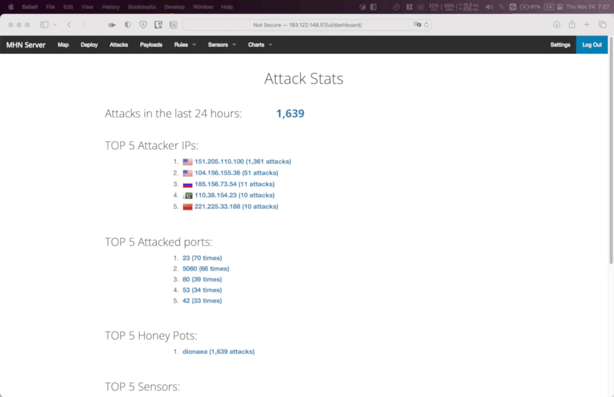

# Honeypot Assignment

**Time spent:** **X** hours spent in total

**Objective:** Create a honeynet using MHN-Admin. Present your findings as if you were requested to give a brief report of the current state of Internet security. Assume that your audience is a current employer who is questioning why the company should allocate anymore resources to the IT security team.

### MHN-Admin Deployment (Required)

**Summary:** 

I deployed with Oracle Cloud, after SSH into the cloud instance, I entered the following comands:
```
sudo apt update
sudo apt install git python-magic -y

cd /opt/
sudo git clone https://github.com/pwnlandia/mhn.git
cd mhn/

sudo sed -i 's/Flask-SQLAlchemy==2.3.2/Flask-SQLAlchemy==2.5.1/g' server/requirements.txt

sudo ./install.sh
```

Waif for around 30 minutes or so depends on how powerful the cloud instance is.


### Dionaea Honeypot Deployment (Required)

**Summary:** Briefly in your own words, what does dionaea do?

Dionaea is a honeypot that captures attack payloads and malware so security experts can analyze. Since it's intention is to be attacked, in order to minimize the risk, Dionaea runs in a restricted environment.

Steps to deploy:
1. Provision a new cloud instance with all ports open 
2. Navigate to Deploy tab of MHN-Admin page.
3. Select corresponding script for your operating system and run the deploy command
4. If everything goes well, you should see the instance under Sensors page



### Database Backup (Required) 

**Summary:**  

MHN-Admin uses MongoDB as its underlying RDBMS, the exported JSON file records the date, source ip, source port, destination port and the protocol the attacker uses as well as which honeypot the attacker is targeting.  

[session.json](session.json) retrieved via `mongoexport --db mnemosyne --collection session > session.json`


