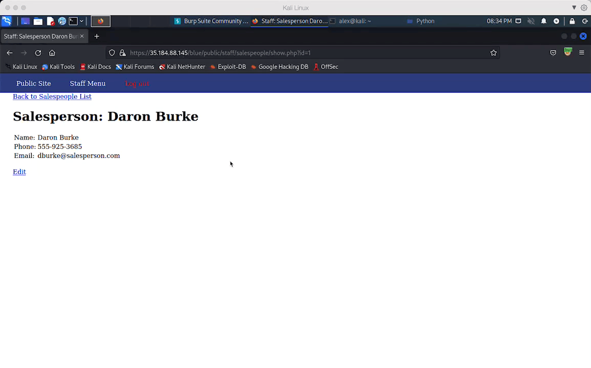

# Pen Testing Live Targets

Time spent: **5** hours spent in total

> Objective: Identify vulnerabilities in three different versions of the Globitek website: blue, green, and red.

The six possible exploits are:

* Username Enumeration
* Insecure Direct Object Reference (IDOR)
* SQL Injection (SQLi)
* Cross-Site Scripting (XSS)
* Cross-Site Request Forgery (CSRF)
* Session Hijacking/Fixation

Each color is vulnerable to only 2 of the 6 possible exploits. First discover which color has the specific vulnerability, then write a short description of how to exploit it, and finally demonstrate it using screenshots compiled into a GIF.

## Blue

Vulnerability #1: SQL Injection (SQLi)

Description:

1. Enter single quote to test/escape the query 
2. The page shows `Database query failed.` and that means it's injectable
3. Encode `' OR 1=1 order by 1 desc#` into url friendly string `'+OR+1%3d1+order+by+1+desc%23`
4. The page shows a totally differnet salesperson

## Green

Vulnerability #1: 

Description:
1. Navigate to Contact and submit `` under feedback
2. Login back as normal user and navigate to feeback, you should see alerts popping up

## Red

Vulnerability #1: Insecure Direct Object Reference (IDOR)

Description:
1. Use BurpSuite to intercept the request and send it to intruder, set paylad to sequenced number and bruteforce it
2. We see that `Testy McTesterson` should not be publicly accessed

