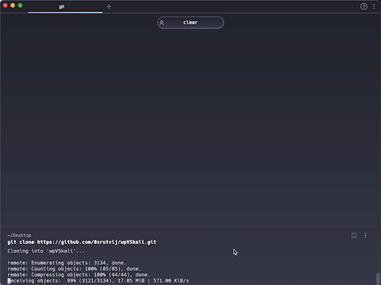
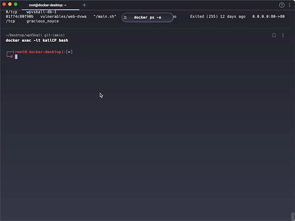

# Project 3 - ~~VirtualBox~~ Docker and Kali

Time spent: **4** hours spent in total

**Homework Instructions**: 

1. Create a GIF recording of you starting your new Kali ~~VM~~ container. ~~Show VirtualBox Manger, click Start on your Kali box and end the recording when it reaches the login prompt.~~ If it's larger than 5 MB, try to remove any large swathes of redudant frames. Save it as `docker_kali.gif`.
2. Create a GIF recording of you running the following command block in your Kali Terminal. Copy it to a text editor first and **replace the first 2 variables, name and univ, with your real name and college name**, then copy/paste the code block into a Terminal. 

```bash
name="FirstName LastName"
univ="University of Science"

screenfetch
echo $name'@'$univ
```

Save the file as `screenfetch.gif`.

**Challenges and Problems**: 

### Installing Kali container


 
### Running screenfetch


